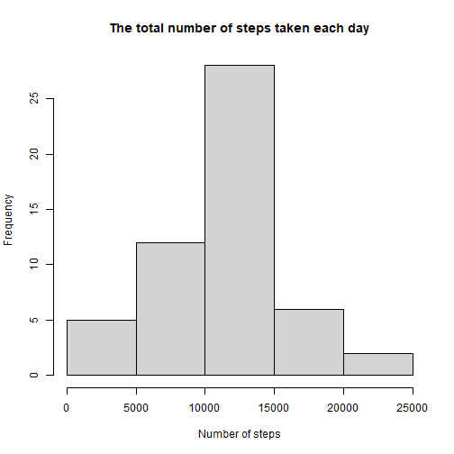
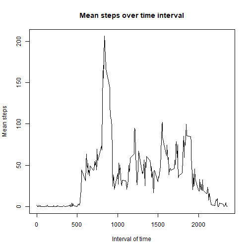
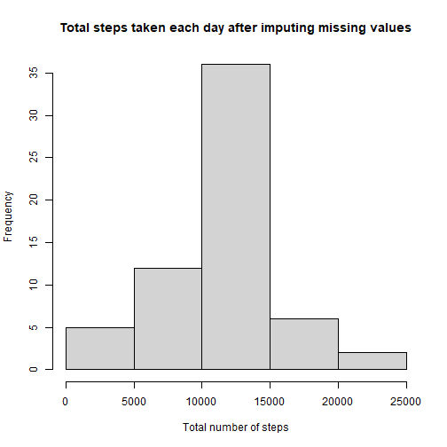
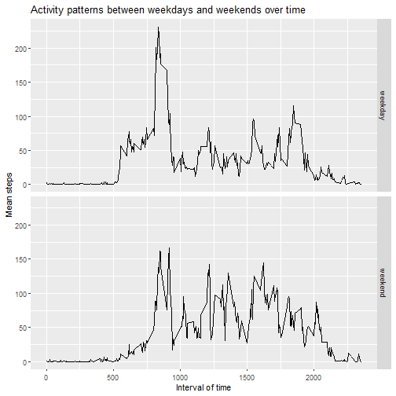

# Introduction
  Activity monitoring devices allowed us to track our health status , in this report i will analyze a data of an anonymous individual collected instantly of steps taken during intervals of 5 minutes each day for 2 months


## Getting and cleaning data :
  The dataset is stored in a comma-separated-value (CSV) file .
  
  The variables included in this dataset are:
  
    * steps: Number of steps taking in a 5-minute interval (missing values are coded as Na)
    * date: The date on which the measurement was taken in YYYY-MM-DD format
    * interval: Identifier for the 5-minute interval in which measurement was taken
### Code for reading data :
    


```r
mywd<-paste0(getwd(),"/activity.csv")
df<-read.csv(mywd,header = TRUE,sep = ",",colClasses = c("integer","character","integer"))
df$date<-ymd(df$date)
head(df)
```

```
##   steps       date interval
## 1    NA 2012-10-01        0
## 2    NA 2012-10-01        5
## 3    NA 2012-10-01       10
## 4    NA 2012-10-01       15
## 5    NA 2012-10-01       20
## 6    NA 2012-10-01       25
```

## Total number of steps taken each day :
The total number of steps taken each day is normally distributed .

```r
df_na_removed<-filter(df,!is.na(steps))
df_grouped_by_date<-group_by(df_na_removed,date)
tot_steps_per_day<-summarise(df_grouped_by_date,tot_num_steps=sum(steps))
hist(tot_steps_per_day$tot_num_steps,main = "The total number of steps taken each day",xlab = "Number of steps")
```



## The mean and median number of steps taken each day :


```r
mean_median<-summarise(tot_steps_per_day,mean_steps=mean(tot_num_steps),median_steps=median(tot_num_steps))
mean_median
```

```
## # A tibble: 1 x 2
##   mean_steps median_steps
##        <dbl>        <int>
## 1     10766.        10765
```

## Time series plot of the average number of steps taken :


```r
df_grouped_by_interval<-group_by(df_na_removed
                      ,interval)
mean_steps_by_interval<-summarise(df_grouped_by_interval,daily_activity=mean(steps))
with(mean_steps_by_interval,plot(interval,daily_activity,type="l",xlab ="Interval of time",ylab = "Mean steps",main="Mean steps over time interval"))
```



## 5 min interval of the maximum number of steps taken :

```r
max_index<-which(mean_steps_by_interval$daily_activity==max(mean_steps_by_interval$daily_activity))
mean_steps_by_interval[max_index,]
```

```
## # A tibble: 1 x 2
##   interval daily_activity
##      <int>          <dbl>
## 1      835           206.
```

## The number of missing data :


```r
Na_number<-sum(is.na(df$steps))
Na_number
```

```
## [1] 2304
```

## Code for imputing missing data
i used the mean of steps related to the 5 min interval to fill in the missing data .


```r
NA_indices<-which(is.na(df$steps))
NA_interval<-df$interval[NA_indices]
Na_imputed_df<-copy(df)

for (i in 1:length(df$steps)) {

  if(is.na(df$steps[i])){
    
     Na_imputed_df$steps[i]<-mean_steps_by_interval[which(df$interval[i]==mean_steps_by_interval$interval),2]
     
  }
  class(Na_imputed_df$steps)<-"numeric" 
}
```

## Histogram of the total number of steps taken each day after missing values are imputed :


```r
Na_imputed_df_grpd_by_date<-group_by(Na_imputed_df,date)
Na_imputed_tot_steps_per_day<-summarise(Na_imputed_df_grpd_by_date,tot_num_steps=sum(steps))  
hist(Na_imputed_tot_steps_per_day$tot_num_steps,main = "Total steps taken each day after imputing missing values",xlab = "Total number of steps")
```



## The mean and median of steps taken each day before and after imputing missing values :
the mean and median of steps taken each day before and after imputing missing values are equal .


```r
Na_imputed_mean_median<-summarise(Na_imputed_tot_steps_per_day,mean_steps=mean(tot_num_steps),median_steps=median(tot_num_steps))
compare_param <- data.frame(rbind(mean_median,Na_imputed_mean_median),row.names = c("Before","After"))
compare_param
```

```
##        mean_steps median_steps
## Before   10766.19     10765.00
## After    10766.19     10766.19
```

## The differences in activity patterns between weekdays and weekends


```r
for (i in 1:length(Na_imputed_df$steps)) {
  weekday<-weekdays(Na_imputed_df$date[i])
  if (weekday=="samedi" | weekday=="dimanche") {
    Na_imputed_df$which_day[i]<-"weekend"
  }else{  Na_imputed_df$which_day[i]<-"weekday" }
 
}

Na_imputed_df_grpd_by_which_day<-Na_imputed_df %>% group_by(which_day,interval)
avrg_steps_weekdays.ends<-summarise(Na_imputed_df_grpd_by_which_day,which_day=which_day ,interval=interval,avrg_steps=mean(steps))

g<-ggplot(avrg_steps_weekdays.ends,aes(x=interval,y=avrg_steps))+geom_line()
g+facet_grid(rows = vars(which_day))+labs(title = "Activity patterns between weekdays and weekends over time")+xlab("Interval of time")+ylab("Mean steps")
```



